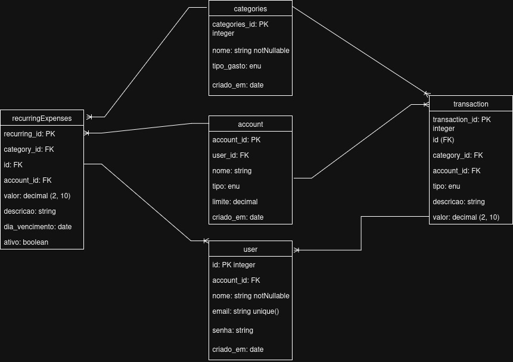

# Finanças Pessoais


---

## Visão Geral do Projeto

O **Finanças Pessoais** é uma aplicação web intuitiva para gerenciamento financeiro pessoal. Desenvolvida para ser o seu principal painel de controle, ela oferece uma visão clara e objetiva sobre suas receitas, despesas e saldo, ajudando você a tomar decisões financeiras mais inteligentes.

Este projeto foi construído do zero como um estudo prático de desenvolvimento full-stack, com foco em:
* **Back-end robusto:** Construído com Node.js, Express e Knex.js para uma API RESTful e manipulação de banco de dados.
* **Front-end moderno:** Interface de usuário fluida e responsiva, utilizando HTML, CSS (com Tailwind CSS) e JavaScript Vanilla.
* **Visualização de dados:** Gráficos interativos para uma análise financeira detalhada.

---

## Diagrama do Banco de Dados

A arquitetura do banco de dados foi projetada para ser robusta e escalável. O modelo de dados centraliza as transações, conectando-as a usuários, contas e categorias, garantindo uma gestão financeira organizada e eficiente.



---

## Funcionalidades

* **Dashboard Interativa:** Visualize seu saldo total e a distribuição de gastos por categoria através de gráficos de pizza e de barras.
* **Gerenciamento de Transações:** Adicione, edite e delete entradas e saídas de forma simples.
* **Registro de Contas:** Gerencie suas diferentes contas bancárias, cartões de crédito e carteiras.
* **Contas Recorrentes:** Mantenha um registro de despesas fixas para uma previsão financeira mais precisa.

---

## Como Executar o Projeto

Siga estes passos para configurar e rodar o projeto em sua máquina local.

### Pré-requisitos

Certifique-se de ter o [Node.js](https://nodejs.org/) e o [npm](https://www.npmjs.com/) instalados.

```bash
1. Clonar o Repositório

git clone [https://github.com/seu-usuario/seu-repositorio.git](https://github.com/seu-usuario/seu-repositorio.git)
cd seu-repositorio

2. Instalar as Dependências

Instale todas as dependências do projeto, tanto para o front-end quanto para o back-end.

npm install

3. Configurar o Banco de Dados

Este projeto utiliza o Knex.js para gerenciar o banco de dados.
Primeiro, crie a configuração do seu banco de dados no arquivo knexfile.js.

Em seguida, execute as migrações para criar as tabelas no seu banco de dados:

npx knex migrate:latest

4. Iniciar o Servidor

Para iniciar o servidor em ambiente de desenvolvimento, utilize o Nodemon para que as alterações de código sejam reiniciadas automaticamente.

npm run dev

(Se você não configurou o script "dev" no package.json, use nodemon server.js ou node server.js)

5. Acessar a Aplicação

Abra seu navegador e acesse:

http://localhost:3000

---

### 🛠 Tecnologias Utilizadas

Back-end:

    Node.js: Ambiente de execução JavaScript.

    Express.js: Framework web para Node.js.

    Knex.js: Construtor de consultas SQL para interagir com o banco de dados.

Front-end:

    HTML5: Estrutura da aplicação.

    CSS3: Estilização.

    Tailwind CSS: Framework utilitário de CSS para design rápido e responsivo.

    JavaScript: Lógica de interatividade do front-end.

    Chart.js: Biblioteca para criação de gráficos.

---

📄 Licença

Este projeto está sob a licença MIT. Para mais detalhes, veja o arquivo LICENSE.

---

🤝 Contribuições

Contribuições, sugestões e relatórios de bugs são bem-vindos! Sinta-se à vontade para abrir uma issue ou enviar um pull request.
